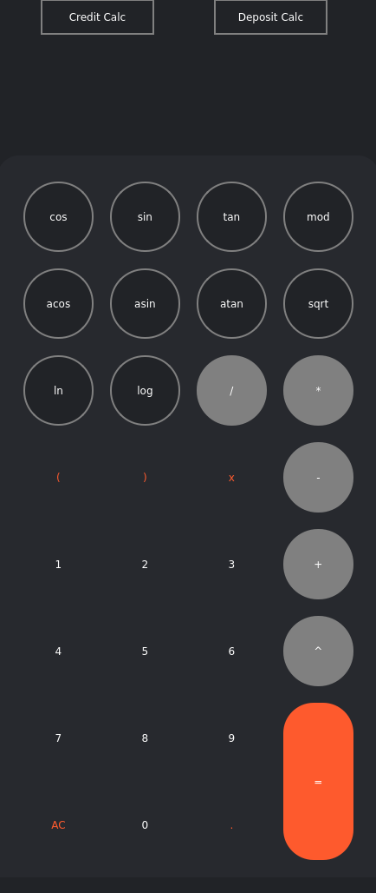
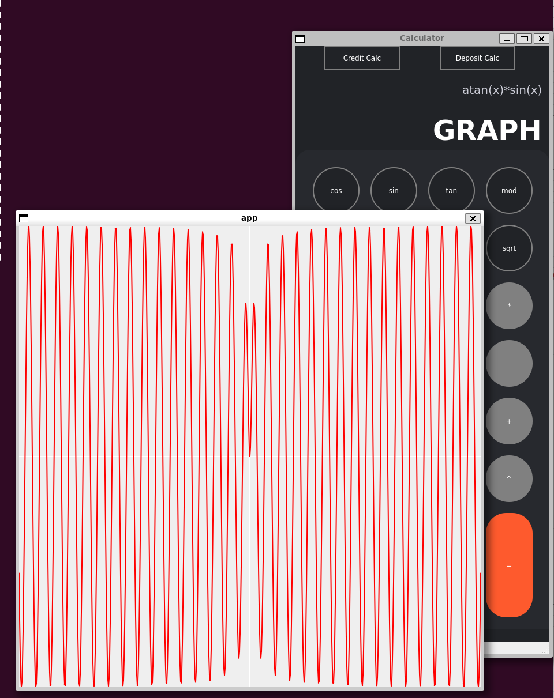
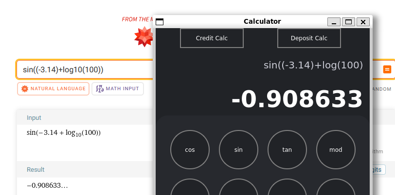
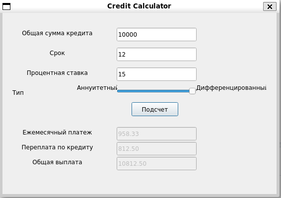
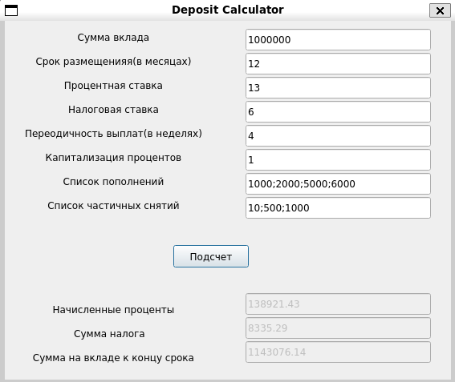

# SmartCalc v1.0

SmartCalc v1.0 is a comprehensive calculator application developed in C (C11 standard) using the GCC compiler and the Qt framework for the graphical user interface. It supports a wide range of arithmetic operations and functions, including the ability to plot graphs for given expressions.

## Features

* **Arithmetic Operations:** Supports basic operations (addition, subtraction, multiplication, division), power, and modulo operations in infix notation with the conversion to and calculation in Polish notation.
* Mathematical Functions: Includes functions like sin, cos, tan, asin, acos, atan, sqrt, ln, and log.
* **Graph Plotting:** Allows plotting of functions with variable x, automatically adjusting the grid and scale within a predefined range.
* **Credit Calculator Mode:** Special mode for calculating monthly payments, total overpayment, and total payment amount for loans.
* **Deposit Calculator Mode:** Special mode for calculating interest, tax, and final deposit amount over a specified term with options for capitalization and periodic contributions or withdrawals.

## Project Structure

```
.
├── Makefile
├── app
│   ├── app.pro
│   ├── credit.cpp
│   ├── credit.h
│   ├── credit.ui
│   ├── deposit.cpp
│   ├── deposit.h
│   ├── deposit.ui
│   ├── graphwindow.cpp
│   ├── graphwindow.h
│   ├── graphwindow.ui
│   ├── main.cpp
│   ├── mainapp.cpp
│   ├── mainapp.h
│   └── mainapp.ui
├── functions
│   ├── calculate_poland.c
│   ├── parse_equation.c
│   ├── stack_char.c
│   └── stack_double.c
├── include
│   ├── poland_notation.h
│   ├── stack_char.h
│   ├── stack_double.h
│   └── test_poland.h
└── tests
    └── test_poland.c
```

## Installation and Usage

### Prerequisites

Before you begin the installation of SmartCalc v1.0, ensure you have the following prerequisites installed on your system:

* GCC compiler supporting C11 standard
* Make tool for building the application
* QT development environment for compiling the GUI part
* Check library for unit testing (if you plan to run tests)
* Other dependencies include: lm, pthread, lrt, subunit libraries

### Compiling the Application

SmartCalc v1.0 uses a Makefile for easy building and managing of the project. Follow these steps to compile the application:

1. Open a Terminal in the project's root directory where the Makefile is located.

2. Run the Make command to compile the project:
    ```bash
    make all
    ```
    This command will compile all necessary libraries and the main application. The make all target is configured to also generate a coverage report by default.

### Running the Application

After compiling, you can run the application using the following steps:

1. **Install the application** to compile the GUI part and prepare it for use:
    ```bash
    make install
    ```
2. **Navigate to the build directory** and run the application:
    ```bash
    cd build
    ./app
    ```
### Additional Makefile Targets

The Makefile includes several targets for managing the application:

* **make clean:** Cleans up the project by removing compiled objects and coverage reports.
* **make test:** Runs unit tests to verify the correctness of the application's logic.
* **make gcov_report:** Generates a coverage report. The report is saved in the report directory as HTML files.
* **make install:** Compiles and prepares the GUI application for use.
* **make uninstall:** Removes the compiled application and cleans up the build artifacts.
* **make dist:** Creates a distributable archive of the application (you need to complete the command as per your project's requirements).

## Graphical User Interface



Picture 1 - Based Menu



Picture 2 - Graph Menu



Picture 3 - Base math and auto fill brackets

## Credit Calculator Mode



Picture 4 - Show UI credit calculator

## Deposit Calculator Mode

The parameter "Interest Capitalization" takes the value 0 - false and 1 - true.



Picture 5 - Show UI deposit calculator

## Contributing

Contributions are welcome to enhance `SmartCalc v1.0`. Feel free to fork the project, make your changes, and submit a pull request.

## License

This project is licensed under the MIT License - see the [LICENSE](LICENSE) file for more details.